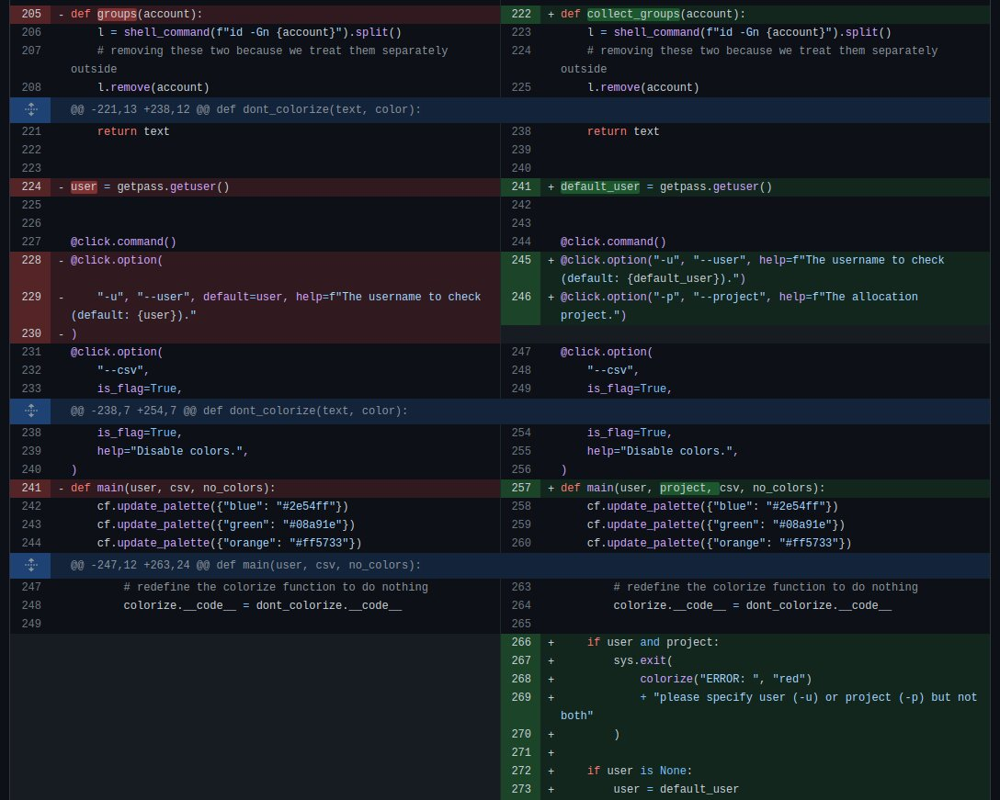
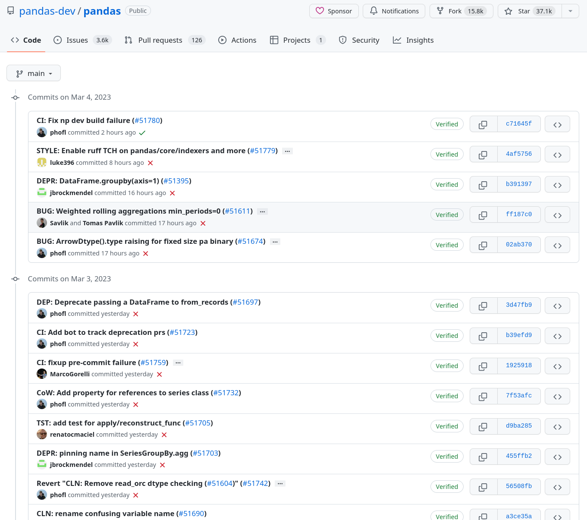
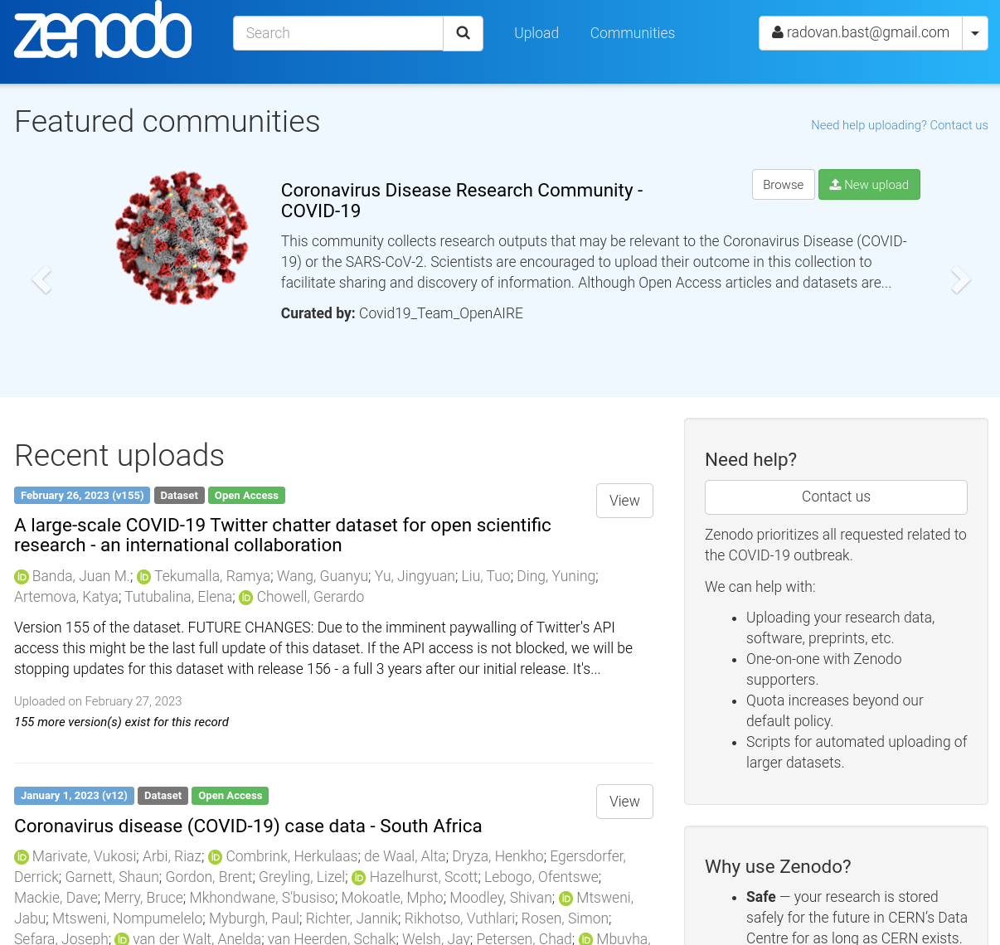
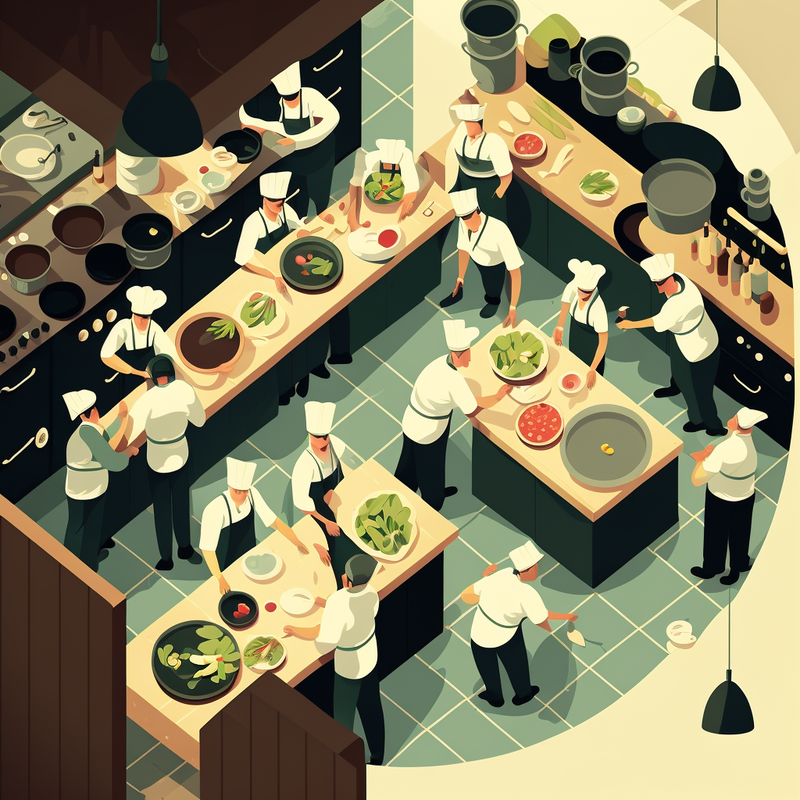

class: gray-background

# Research software engineering (RSE) på 10-15 minuter

.left-column50[
.fat[1:] Hva er problemet?

.fat[2:] Hvem er vi?

.fat[3:] Hva tilbyr vi?

.fat[4:] Hva har vi gjort?

.fat[5:] Hva planlegger vi?
]

.right-column50[
## [research-software.uit.no](https://research-software.uit.no/)

]

---

class: center, middle, inverse

# Hva er problemet?

---

# Hva er problemet?

- Nesten alle forsker og studenter må kode

- De fleste er ikke utdannet for det
  - Kanskje en 2 uker Python eller R kurs
  - Ofte ganske abstrakt

- Fokus på forskning og ikke program utvikling

- Flere og flere forventninger på forskerne
  - FAIR
  - Deling av kode og resultater (OpenSource / OpenScience)
  - Reproduserbar forskning (Gitt, tidy data, package management)

- Mange prosjekter har dårlig dokumentasjon -> __dør en langsom død__

---

# Hva slags hjelp er tilgjengelig?

- Online
  - Mixed quality
  - Tar tid å finne
  - Ofte ikke aktuelt

- Kolleger
  - Hyppig i same situasjon
  - Mer erfaring med feltet men vanlig også ingen utdanning

- Dokumentasjon
  - Ofte høye kvalitet
  - Mye jargon og vanskelig å forstå

---

# Hva mangler?

- Enkelt tilgjengelig og direkte hjelp

- Kontakt som forstår spesielle problemer forsker har

- Mentoring mht programmering og utvikling 

---

# RSE som løsning

- Kombinerer programvareekspertise med en forståelse av forskning

- Brukerstøtte for forsker og studenter

- Alle slags problemstillinger

- Lav terskel tilbud (epost, åpen skranke)

---

# Hvem er vi?

- Aktuell 4 folk med kjemi og bio bakgrunn

- Erfaring og interesse i koding

- Alle del av ITA & NRIS

-> Kombinasjon av forståelse av forskning og profesjonelt programutvikling

---

class: center, middle, inverse

# Hva tilbyr vi?

---

# Hjelp med forbedring av skripter

- .emph[Code review](we snakker om koden på en konstruktiv måte)
- Lage koden .emph[mer gjenbrukbar]
- Tips og anbefalinger med hesnikt til dokumentasjon

---

# Hjelp med kode organisering 

.left-column50[
- Git, GitHub, and GitLab

- Flytte prosjektet til Git

- Modularisering av kode og skripter

- Organisasjon av gjenbrukbare Python/R notebooker
]

.right-column50[

]

---

# Hjelp med deling av kode

.left-column50[
- Hjelp med programvarelisenser og open source

- Publisering av kode

- Pakking og deling av programvare

- Containerization (Singularity, Docker)

- PyPI and Conda
]

.right-column50[

]

---

# Hjelp med akselerere resultater

.left-column50[
- Forbedre skalering, CPU, and memory optimization

- Overføring til GPU

- Flytte fra lokal datamaskin til sky eller HPC

- Hjelp med parallellisering av uavhengige trinn
]

.right-column50[

.cite[Midjourney, CC-BY-NC 4.0]
]

---

class: center, middle, inverse

# Hva har vi gjort?

---

# Noen eksempler av vår arbeid

Mer på https://research-software.uit.no/projects/ og https://research-software.uit.no/blog/

---

# Hjelp med utvikle en GUI

- Forsker med en eksisterende Python programvare

- Funger, men bare command line interface -> vanskelig å bruke

- Øke brukervennlighet med en grafisk interface

- Sammen med oss utviklet vi et PyQt rammeverk

---

# Hjelp med R programmering

- Biologi master student

- Har problem med R skripter for masteroppgave

- En-til-en code review

- Takle akutt problemer

- Men også diskutere generelle skript struktur

---

# Hjelp med transkribere og modernisere av gammel kode

- Visual Basic 6 programvare

- Mer enn 15000 linjer

- Stor andel av kodeduplikat

- Skissere et nytt struktur på object-oriented python

- Følge opp med jevnlige code review møter

---

class: center, middle, inverse

# Hva planlegger vi?

---

# Vår visjon

## Kortsiktig

- Tilby rådgivning: Godt råd er ikke dyrt
- Code reviews
- Arbeide med "mindre" prosjekter og dokumentere brukstilfeller
- Trekke til seg flere prosjekter
- Bli kjent på veileder- og studentnivå 

## Langsiktig

- Delta i søknader om finansiering
- Tilby førsteklasses RSE-tjenester til forskningsgrupper
- Ansette mer personale som samarbeider på prosjekter
- Etablere en "riktig" søknadsprosedyre
- Gå utover UiT
- Karrieremuligheter

---

class: center, middle, inverse

# Åpent kontor: Onsdager 13-15

## Kontakt: https://research-software.uit.no/contact/
